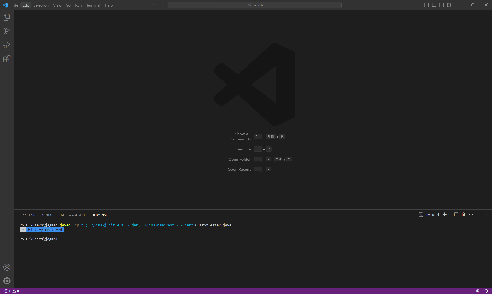
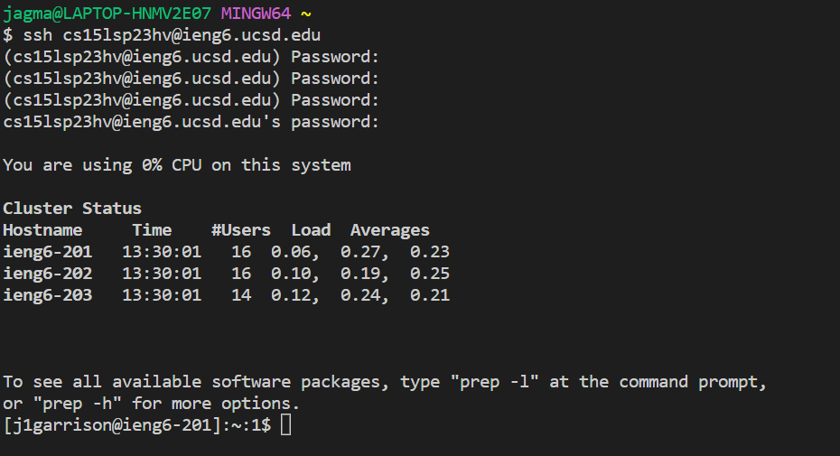
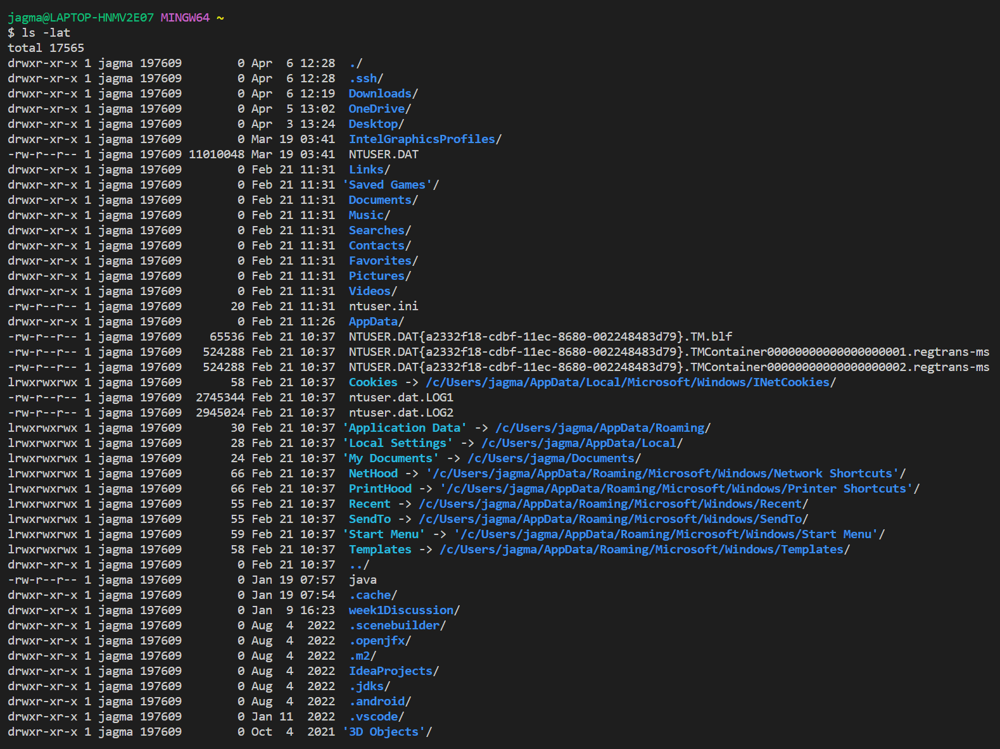

# Lab Report 1
## Description
This lab report includes how to download Visual Studio Code, how to connect to the remote access computer using ssh, and then running some commands once connected.

## Step 1: Downloading Visual Studio Code
Visual Studio Code (VSCode) is what is used to connect to the remote computer so we have to download it first before attemtping to connect. If you don't already have VSCode installed, go to the link at [VSCode Download](https://code.visualstudio.com/) and follow the installation instructions. Once downloaded, open a window that should look like the following image. 


## Step 2: Remotely Connecting to the Computer Server
Before we trying connecting, we need to install [git](https://gitforwindows.org/) for Windows. If you have a Mac then it is already installed on your computer so you don't have to worry about this part of the step. Once installed, go to the VSCode window and open a new terminal. This can be done by either pressing the \` and ctrl keys at the same time or by clicking on the terminal tab at the top left and then clicking "new terminal". Then open the command pallette by pressing the ctrl, Shift, and P keys at the same time. Then type Select New Profile and select Git Bash from the options. Then in the terminal, click the + on the right side and a new terminal using Git Bash is created. 
Now to remotely connect to the server. Use a command that looks like `$ ssh cs15lsp23hv@ieng6.ucsd.edu` but the `hv` should be replaced by your own course specific letters. If it is your first time connecting, you will likely receive a message that looks like:
```
The authenticity of host 'ieng6.ucsd.edu (128.54.70.227)' can't be established.
RSA key fingerprint is SHA256:ksruYwhnYH+sySHnHAtLUHngrPEyZTDl/1x99wUQcec.
Are you sure you want to continue connecting (yes/no/[fingerprint])?
```
You don't have to worry too much about this message so just go ahead and type yes and then press Enter. From here the terminal will ask for your password. This is the password for your course-specific account for CSE15l. For privacy and security reasons, your password will not show as you are typing. Once you enter in your password, the terminal will output something similar to the following image.


This means you have successfully connected to the server! If the terminal repeatedly asks for your password that means that you are inputting the wrong password. 

## Step 3: Running Some Commands
There are several commands that you can run but the main ones you should try start with `cd`, `ls`, `pwd`, `mkdir`, and `cp`. The cd command allows you to change the current working directory. Using cd by itself takes you back to the home directory. Lets say I use the ls command first and find the files within the current working directory. From there I can use a cd command combined with one of the file names displayed from the ls command to change the current working directory to that file. ls by itself lists the files and other directories in the current working directory that aren't hidden. Attaching -a after the ls would do the same thing but also include hidden files which are file names that begin with a dot. ls -l lists the files in a long list format that displays other useful information such as when the file was last modified. There are many more combinations of commands that can be explored but that can be left up to you find out!
Some examples are: 
* The commands above by themselves
* `cd ~`
* `ls -lat`
* `ls -a`
* `cp /home/linux/ieng6/cs15lsp23/public/hello.txt ~/`

Running `ls lat` should produce something like the following image: 


Once you are satisfied after running some commands, you can exit the terminal by typing `exit`. hello
